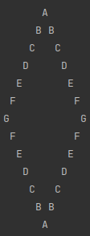

# Projeto para criar uma figura no formato de diamante com o perímetro feito de letras.


# Contexto
Esse projeto tem como objetivo criar uma aplicação onde seja possível a partir de uma letra passada por pele terminal/console, criar uma figura no formato de diamante conforme exemplo abaixo, letra passada determina o tamanho do diamante.
  


## Tecnologias usadas

Back-end - Desenvolvido usando: 
* .Net/C# - Como ferramenta de desenvolvimento e linguagem.
* Rider / VSCode - Suíte de desenvolvimento.
* Git/Github - Para armazenar e versionar a aplicação.

# Clonar o projeto.
 Execute o comando abaixo no seu terminal.

```
git clone git@github.com:imarmendes/diamondProject.git

```

# Executar o projeto
Após o projeto ser clonado, poderá ser executado com os os comando abaixo.

```
cd diamondProject/src &&
dotnet restore &&
cd diamond &&
dotnet run
```

# Testes

Para executar os testes precisa esta na pasta /src ou /diamond.Test, e caso ainda não tenha executado a aplicação, o comando "dotnet restore" é necessário antes de executar os testes.

Comando para executar teste:

```
dotnet test
```

# Outras Funcionalidades:

## E-mail
A aplicação também permite que, após a geração do diamante, o mesmo seja enviado por e-mail, para é pergunta se deseja enviar por e-mail, recebendo uma reposta afirmativa, um e-mail para envio é solicitado, após inserir o e-mail, a aplicação mostra uma mensagem de enviando e enviado com sucesso.

Observação: Estou usando um e-mail da Microsoft para enviar os e-mails, porem se mandamos muitos e-mails em um curto espaço de tempo, o servidor entende como atividade suspeita e suspende o e-mail temporariamente, para contornar isso, deixo aqui mais uma alternativa de endereço que pode ser usado para envio, caso tente executar e receba uma mensagem de que o e-mail esta suspenso, basta substituir o e-mail no arquivo /src/diamond/Email.cs linha 46, somente essa linha precisa ser alterada.

```
imarteste2@outlook.com
```

## PDF
A aplicação também permite que, após a geração do diamante, o mesmo seja enviado por e-mail, para é pergunta se deseja criar um PDF com o diamante gerado, recebendo uma reposta afirmativa, o PDF será criado na pasta /src/diamods.

Observação: Tanto no projeto da aplicação com no de testes, a pasta diamonds já esta criada e com um arquivo .emptyFile.txt, esse arquivo é necessário para que o git não considera a pasta vazia e a desconsidere por isso.

# Futuro
Para o futuro pretendo ciar uma aplicação web que permita que a interação com o usuário seja via browser, bem como adicionar a possibilidade de construir outras figuras.

### Autor
- Francisco <strong>Imar Mendes</strong>
- Desenvolvedor Fullstack
- .Net/C# - Java - Javascript
- [Linkedin](https://www.linkedin.com/in/imarmendes/)

